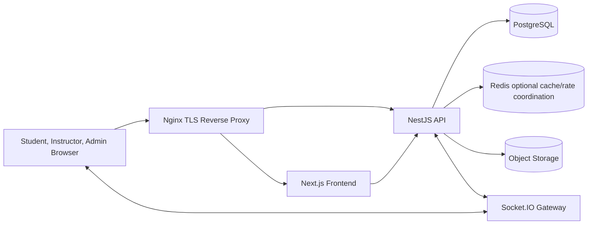
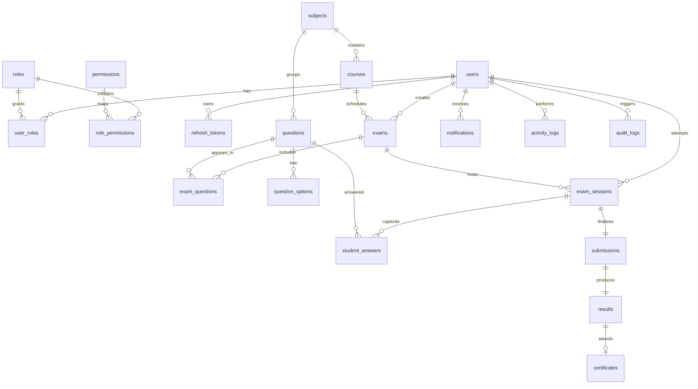

# Online Examination System Architecture

## Architecture Overview

The system uses a separated frontend/backend architecture. The frontend is optimized for server-rendered navigation and rich client interactions where needed. The backend exposes REST APIs and realtime Socket.IO channels. PostgreSQL is the primary transactional store and Prisma is the canonical schema layer.

## Runtime Topology

## ER Diagram

## Multi-Tenant Readiness

Core tables include `tenantId` where institution-level isolation is expected. The current code keeps the tenant model explicit and lightweight so it can be promoted to row-level security or schema-per-tenant when a deployment requires it.

## Scalability Notes

- Stateless API containers can scale horizontally behind Nginx or a cloud load balancer.
- Long-running reports should move to queues when report volumes grow.
- Socket.IO can use Redis adapter in production for multi-node realtime fanout.
- Exam autosave writes are idempotent and can be throttled per session.
- Question and option randomization should be computed at session start and persisted.

## Output Order Traceability

1. High-Level Architecture: this file and root README.
2. Complete Folder Structure: root README and generated tree.
3. Database Design: Prisma schema and database docs.
4. ER Diagram: Mermaid diagram above.
5. Prisma Schema: `backend/prisma/schema.prisma`.
6. API Design: `docs/api.md`.
7. Backend Modules: `backend/src`.
8. Frontend Architecture: `frontend/src`.
9. UI/UX Design System: `docs/ui-ux.md`.
10. Authentication Flow: `docs/security.md`.
11. Security Architecture: `docs/security.md`.
12. WebSocket Architecture: `docs/websocket.md`.
13. DevOps Architecture: `deployment` and `docs/devops.md`.
14. Step-by-Step Implementation Plan: root README.
15. Full Source Code: repository source files.
