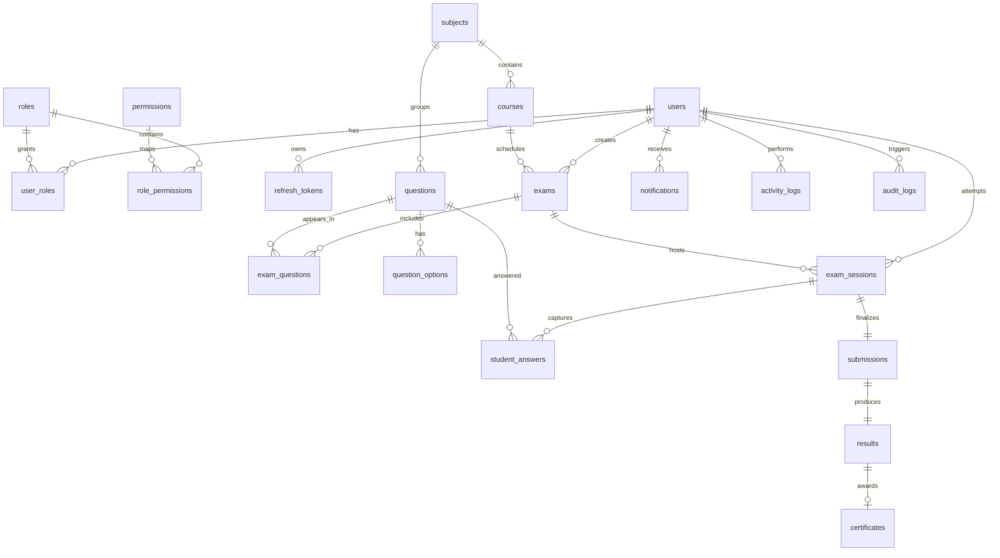

# Online Examination System — Database Design Report

Authoritative source: `backend/prisma/schema.prisma` (Prisma migrates to PostgreSQL). This document describes every model, table, field, key, constraint, and relationship so the ER diagram and design explanation can be produced without assumptions.

Source files:
- Schema: `backend/prisma/schema.prisma`
- Migrations: `backend/prisma/migrations/`
- Seed data: `backend/prisma/seed.ts`
- Existing docs: `docs/architecture.md`, `database/README.md`

---

## 1. Database Engine & Configuration

- Provider: **PostgreSQL** (`provider = "postgresql"`).
- Connection URL from env `DATABASE_URL`; `DIRECT_DATABASE_URL` used by Prisma Migrate when the runtime URL is pooled (e.g. Neon pgBouncer).
- Every existing table uses a **string UUID primary key** `id @id @default(uuid())`, except `platform_settings` (which uses a natural-string primary key `key`).
- Multi-tenancy: most core business tables carry an optional `tenantId String?` column for institution-level isolation (row-level / schema-per-tenant readiness). It is nullable and not yet populated or foreign-key constrained.

---

## 2. Enums (domain value types)

| Enum | Values |
|------|--------|
| `UserStatus` | ACTIVE, PENDING_VERIFICATION, SUSPENDED, DEACTIVATED |
| `RoleName` | SUPER_ADMIN, ADMIN, INSTRUCTOR, STUDENT |
| `ExamStatus` | DRAFT, SCHEDULED, PUBLISHED, LIVE, CLOSED, ARCHIVED |
| `QuestionType` | MULTIPLE_CHOICE, MULTIPLE_SELECT, TRUE_FALSE, FILL_BLANK, SHORT_ANSWER, ESSAY, MATCHING |
| `Difficulty` | EASY, MEDIUM, HARD, EXPERT |
| `QuestionBankStatus` | DRAFT, PUBLISHED |
| `SessionStatus` | NOT_STARTED, IN_PROGRESS, PAUSED, SUBMITTED, AUTO_SUBMITTED, EXPIRED, FLAGGED |
| `SubmissionStatus` | SUBMITTED, AUTO_SUBMITTED, NEEDS_MANUAL_GRADING, GRADED, PUBLISHED |
| `NotificationType` | INFO, WARNING, SUCCESS, EXAM_REMINDER, RESULT_PUBLISHED, SYSTEM |
| `ViolationType` | TAB_SWITCH, WINDOW_BLUR, FULLSCREEN_EXIT, COPY_PASTE, MULTIPLE_FACE_READY, NO_FACE_READY, HEARTBEAT_MISSED, NETWORK_INTERRUPTION, MANUAL_FLAG |
| `ConnectionState` | CONNECTED, DISCONNECTED, RECONNECTING |
| `RiskLevel` | LOW, MEDIUM, HIGH, CRITICAL |
| `ExamPermissionLevel` | VIEWER, MONITOR, PROCTOR, CO_OWNER |
| `ExamEventType` | EXAM_STARTED, EXAM_RESUMED, QUESTION_VIEWED, QUESTION_ANSWERED, QUESTION_FLAGGED, TAB_SWITCHED, WINDOW_BLURRED, WINDOW_FOCUSED, FULLSCREEN_EXITED, FULLSCREEN_ENTERED, COPY_ATTEMPT, PASTE_ATTEMPT, CUT_ATTEMPT, PRINT_ATTEMPT, CONTEXT_MENU_ATTEMPT, SHORTCUT_ATTEMPT, CAMERA_CONNECTED, CAMERA_DISCONNECTED, MIC_CONNECTED, MIC_DISCONNECTED, FACE_DETECTED, FACE_NOT_DETECTED, MULTIPLE_FACES_DETECTED, MOTION_DETECTED, AUDIO_ACTIVITY, AI_SIGNAL, MANUAL_FLAG, CONNECTION_LOST, CONNECTION_RESTORED, EXAM_SUBMITTED, PAUSED, RESUMED, TIME_EXTENDED, FORCE_SUBMITTED, SESSION_DISCONNECTED, WARNING_SENT, NOTE_ADDED |

`ContactMessage.status` is a plain `String` (default `"NEW"`), not an enum.

---

## 3. Models / Tables, Fields, and Keys

> Conventions: `PK` = primary key, `FK` = foreign key, `UQ` = unique. All `id` PKs are UUID strings. `@updatedAt` auto-set on update.

### 3.1 users
Physical table: `users`
| Field | Type | Constraints |
|-------|------|-------------|
| `id` | String | **PK** |
| `tenantId` | String? | |
| `email` | String | **UQ** |
| `passwordHash` | String | |
| `firstName` | String | |
| `lastName` | String | |
| `phone` | String? | |
| `avatarUrl` | String? | |
| `status` | UserStatus | default PENDING_VERIFICATION |
| `emailVerifiedAt` | DateTime? | |
| `lastLoginAt` | DateTime? | |
| `createdAt` | DateTime | default now() |
| `updatedAt` | DateTime | @updatedAt |

Indexes: `@@index([tenantId])`, `@@index([status])`, `@@index([createdAt])`.

### 3.2 roles
Physical table: `roles`
| Field | Type | Constraints |
|-------|------|-------------|
| `id` | String | **PK** |
| `name` | RoleName | **UQ** |
| `description` | String? | |
| `createdAt` | DateTime | default now() |
| `updatedAt` | DateTime | @updatedAt |

### 3.3 permissions
Physical table: `permissions`
| Field | Type | Constraints |
|-------|------|-------------|
| `id` | String | **PK** |
| `key` | String | **UQ** |
| `label` | String | |
| `module` | String | |
| `createdAt` | DateTime | default now() |

Index: `@@index([module])`.

### 3.4 role_permissions (M:N join — Role ↔ Permission)
Physical table: `role_permissions`
| Field | Type | Constraints |
|-------|------|-------------|
| `roleId` | String | **PK part**, **FK → roles.id** (Cascade) |
| `permissionId` | String | **PK part**, **FK → permissions.id** (Cascade) |

Composite PK: `@@id([roleId, permissionId])`. Unique on the pair.

### 3.5 user_roles (M:N join — User ↔ Role)
Physical table: `user_roles`
| Field | Type | Constraints |
|-------|------|-------------|
| `userId` | String | **PK part**, **FK → users.id** (Cascade) |
| `roleId` | String | **PK part**, **FK → roles.id** (Cascade) |

Composite PK: `@@id([userId, roleId])`. Unique on the pair.

### 3.6 subjects
Physical table: `subjects`
| Field | Type | Constraints |
|-------|------|-------------|
| `id` | String | **PK** |
| `tenantId` | String? | |
| `code` | String | |
| `name` | String | |
| `description` | String? | |
| `createdAt` | DateTime | default now() |
| `updatedAt` | DateTime | @updatedAt |

Unique/constraint: `@@unique([tenantId, code])`. Index: `@@index([tenantId])`.

### 3.7 courses
Physical table: `courses`
| Field | Type | Constraints |
|-------|------|-------------|
| `id` | String | **PK** |
| `tenantId` | String? | |
| `subjectId` | String | **FK → subjects.id** (no cascade) |
| `code` | String | |
| `name` | String | |
| `description` | String? | |
| `createdAt` | DateTime | default now() |
| `updatedAt` | DateTime | @updatedAt |

Unique/constraint: `@@unique([tenantId, code])`. Index: `@@index([subjectId])`.

### 3.8 exams
Physical table: `exams`
| Field | Type | Constraints |
|-------|------|-------------|
| `id` | String | **PK** |
| `tenantId` | String? | |
| `courseId` | String | **FK → courses.id** |
| `questionBankId` | String? | **FK → question_banks.id** (optional) |
| `createdById` | String | **FK → users.id** (relation "ExamCreator") |
| `title` | String | |
| `slug` | String | **UQ** |
| `description` | String? | |
| `instructions` | String? | |
| `durationMinutes` | Int | |
| `totalMarks` | Decimal | |
| `passingMarks` | Decimal | |
| `negativeMarkingRate` | Decimal | default 0 |
| `attemptsAllowed` | Int | default 1 |
| `randomizeQuestions` | Boolean | default true |
| `randomizeOptions` | Boolean | default true |
| `fullscreenRequired` | Boolean | default true |
| `showResultImmediately` | Boolean | default false |
| `resumeApprovalRequired` | Boolean | default false |
| `startsAt` | DateTime | |
| `endsAt` | DateTime | |
| `status` | ExamStatus | default DRAFT |
| `createdAt` | DateTime | default now() |
| `updatedAt` | DateTime | @updatedAt |

Indexes: `@@index([tenantId])`, `@@index([courseId])`, `@@index([createdById])`, `@@index([status, startsAt, endsAt])`.

### 3.9 question_banks
Physical table: `question_banks`
| Field | Type | Constraints |
|-------|------|-------------|
| `id` | String | **PK** |
| `tenantId` | String? | |
| `courseId` | String | **FK → courses.id** |
| `categoryId` | String | **FK → subjects.id** (acts as category) |
| `createdById` | String | **FK → users.id** (relation "QuestionBankCreator") |
| `name` | String | |
| `description` | String? | |
| `difficulty` | Difficulty? | |
| `status` | QuestionBankStatus | default DRAFT |
| `createdAt` | DateTime | default now() |
| `updatedAt` | DateTime | @updatedAt |

Indexes: `@@index([tenantId])`, `@@index([courseId])`, `@@index([categoryId])`, `@@index([status])`.

### 3.10 questions
Physical table: `questions`
| Field | Type | Constraints |
|-------|------|-------------|
| `id` | String | **PK** |
| `tenantId` | String? | |
| `subjectId` | String | **FK → subjects.id** |
| `questionBankId` | String? | **FK → question_banks.id** (optional) |
| `createdById` | String | **FK → users.id** (relation "QuestionCreator") |
| `type` | QuestionType | |
| `difficulty` | Difficulty | default MEDIUM |
| `prompt` | String | |
| `explanation` | String? | |
| `points` | Decimal | default 1 |
| `negativePoints` | Decimal | default 0 |
| `tags` | String | |
| `topic` | String? | |
| `imageUrl` | String? | |
| `sortOrder` | Int | default 0 |
| `isActive` | Boolean | default true |
| `createdAt` | DateTime | default now() |
| `updatedAt` | DateTime | @updatedAt |

Indexes: `@@index([tenantId])`, `@@index([subjectId, type, difficulty])`, `@@index([questionBankId])`, `@@index([type])`, `@@index([difficulty])`, `@@index([createdAt])`.

### 3.11 question_options
Physical table: `question_options`
| Field | Type | Constraints |
|-------|------|-------------|
| `id` | String | **PK** |
| `questionId` | String | **FK → questions.id** (Cascade) |
| `label` | String | |
| `text` | String | |
| `isCorrect` | Boolean | default false |
| `sortOrder` | Int | default 0 |
| `createdAt` | DateTime | default now() |

Unique/constraint: `@@unique([questionId, label])`. Index: `@@index([questionId])`.

### 3.12 exam_questions (M:N join — Exam ↔ Question)
Physical table: `exam_questions`
| Field | Type | Constraints |
|-------|------|-------------|
| `id` | String | **PK** |
| `examId` | String | **FK → exams.id** (Cascade) |
| `questionId` | String | **FK → questions.id** |
| `points` | Decimal | |
| `sortOrder` | Int | default 0 |

Unique/constraint: `@@unique([examId, questionId])`. Index: `@@index([questionId])`.

### 3.13 exam_courses (M:N join — Exam ↔ Course)
Physical table: `exam_courses`
| Field | Type | Constraints |
|-------|------|-------------|
| `id` | String | **PK** |
| `examId` | String | **FK → exams.id** (Cascade) |
| `courseId` | String | **FK → courses.id** |

Unique/constraint: `@@unique([examId, courseId])`. Index: `@@index([courseId])`.

### 3.14 exam_question_banks (M:N join — Exam ↔ QuestionBank)
Physical table: `exam_question_banks`
| Field | Type | Constraints |
|-------|------|-------------|
| `id` | String | **PK** |
| `examId` | String | **FK → exams.id** (Cascade) |
| `questionBankId` | String | **FK → question_banks.id** |

Unique/constraint: `@@unique([examId, questionBankId])`. Index: `@@index([questionBankId])`.

### 3.15 exam_shares
Physical table: `exam_shares`
| Field | Type | Constraints |
|-------|------|-------------|
| `id` | String | **PK** |
| `examId` | String | **FK → exams.id** (Cascade) |
| `instructorId` | String | **FK → users.id** (relation "ExamSharedInstructor", Cascade) |
| `permissionLevel` | ExamPermissionLevel | default VIEWER |
| `grantedById` | String | **FK → users.id** (relation "ExamShareGranter", Cascade) |
| `createdAt` | DateTime | default now() |

Unique/constraint: `@@unique([examId, instructorId])` — an instructor can share an exam at most once. Index: `@@index([instructorId])`.

### 3.16 exam_assignments
Physical table: `exam_assignments`
| Field | Type | Constraints |
|-------|------|-------------|
| `id` | String | **PK** |
| `examId` | String | **FK → exams.id** (Cascade) |
| `studentId` | String | **FK → users.id** (relation "ExamAssignments") |
| `assignedAt` | DateTime | default now() |

Unique/constraint: `@@unique([examId, studentId])` — a student cannot be assigned the same exam twice. Indexes: `@@index([studentId])`, `@@index([examId])`.

### 3.17 exam_sessions
Physical table: `exam_sessions`
| Field | Type | Constraints |
|-------|------|-------------|
| `id` | String | **PK** |
| `examId` | String | **FK → exams.id** |
| `studentId` | String | **FK → users.id** (relation "StudentSessions") |
| `attemptNumber` | Int | default 1 |
| `status` | SessionStatus | default NOT_STARTED |
| `startedAt` | DateTime? | |
| `expiresAt` | DateTime? | |
| `submittedAt` | DateTime? | |
| `remainingSeconds` | Int? | |
| `currentQuestionId` | String? | |
| `currentQuestionIndex` | Int? | |
| `questionOrder` | String? | (serialized question order) |
| `optionOrder` | String? | (serialized option order) |
| `metadata` | String? | |
| `connectionState` | ConnectionState | default CONNECTED |
| `lastHeartbeatAt` | DateTime? | |
| `heartbeatCount` | Int | default 0 |
| `disconnectCount` | Int | default 0 |
| `lastActivityAt` | DateTime? | |
| `riskScore` | Int | default 0 |
| `riskLevel` | RiskLevel | default LOW |
| `retakePermitted` | Boolean | default false |
| `resumeApprovedAt` | DateTime? | |
| `resumeDeniedAt` | DateTime? | |
| `createdAt` | DateTime | default now() |
| `updatedAt` | DateTime | @updatedAt |

Unique/constraint: `@@unique([examId, studentId, attemptNumber])` — a student may have many attempts of an exam, one session per attempt. Indexes: `@@index([studentId, status])`, `@@index([examId, status])`, `@@index([status, expiresAt])`, `@@index([connectionState])`, `@@index([examId, createdAt])`.

### 3.18 student_answers
Physical table: `student_answers`
| Field | Type | Constraints |
|-------|------|-------------|
| `id` | String | **PK** |
| `sessionId` | String | **FK → exam_sessions.id** (Cascade) |
| `questionId` | String | **FK → questions.id** |
| `selectedOptionIds` | String | (serialized selected option ids) |
| `answerText` | String? | |
| `answerJson` | String? | (JSON answer payload) |
| `isBookmarked` | Boolean | default false |
| `isMarkedForReview` | Boolean | default false |
| `savedAt` | DateTime | default now() |
| `score` | Decimal? | |
| `graderId` | String? | **FK → users.id** (relation "AnswerGrader") |
| `feedback` | String? | |

Unique/constraint: `@@unique([sessionId, questionId])` — one answer per question per session. Index: `@@index([questionId])`.

### 3.19 submissions
Physical table: `submissions`
| Field | Type | Constraints |
|-------|------|-------------|
| `id` | String | **PK** |
| `sessionId` | String | **UQ**, **FK → exam_sessions.id** (Cascade) |
| `status` | SubmissionStatus | default SUBMITTED |
| `submittedAt` | DateTime | default now() |
| `autoSubmitted` | Boolean | default false |
| `totalScore` | Decimal | default 0 |
| `maxScore` | Decimal | default 0 |
| `percentage` | Decimal | default 0 |
| `isPassed` | Boolean | default false |
| `gradingCompletedAt` | DateTime? | |

Indexes: `@@index([status, submittedAt])`, `@@index([sessionId])`.

### 3.20 results
Physical table: `results`
| Field | Type | Constraints |
|-------|------|-------------|
| `id` | String | **PK** |
| `submissionId` | String | **UQ**, **FK → submissions.id** (Cascade) |
| `examId` | String | **FK → exams.id** |
| `studentId` | String | **FK → users.id** |
| `score` | Decimal | |
| `maxScore` | Decimal | |
| `percentage` | Decimal | |
| `grade` | String? | |
| `passed` | Boolean | |
| `feedback` | String? | |
| `publishedAt` | DateTime? | |
| `createdAt` | DateTime | default now() |

Indexes: `@@index([examId])`, `@@index([studentId])`, `@@index([percentage])`, `@@index([createdAt])`.

### 3.21 certificates
Physical table: `certificates`
| Field | Type | Constraints |
|-------|------|-------------|
| `id` | String | **PK** |
| `resultId` | String | **UQ**, **FK → results.id** (Cascade) |
| `certificateNo` | String | **UQ** |
| `verificationCode` | String | **UQ** |
| `fileUrl` | String? | |
| `issuedAt` | DateTime | default now() |
| `expiresAt` | DateTime? | |

### 3.22 notifications
Physical table: `notifications`
| Field | Type | Constraints |
|-------|------|-------------|
| `id` | String | **PK** |
| `userId` | String | **FK → users.id** (Cascade) |
| `type` | NotificationType | default INFO |
| `title` | String | |
| `message` | String | |
| `readAt` | DateTime? | |
| `metadata` | String? | |
| `createdAt` | DateTime | default now() |

Indexes: `@@index([userId, readAt])`, `@@index([userId, createdAt])`.

### 3.23 activity_logs
Physical table: `activity_logs`
| Field | Type | Constraints |
|-------|------|-------------|
| `id` | String | **PK** |
| `actorId` | String? | **FK → users.id** (relation "ActorActivity") |
| `examSessionId` | String? | **FK → exam_sessions.id** |
| `action` | String | |
| `ipAddress` | String? | |
| `userAgent` | String? | |
| `metadata` | String? | |
| `createdAt` | DateTime | default now() |

Indexes: `@@index([actorId, createdAt])`, `@@index([examSessionId, createdAt])`.

### 3.24 audit_logs
Physical table: `audit_logs`
| Field | Type | Constraints |
|-------|------|-------------|
| `id` | String | **PK** |
| `actorId` | String? | **FK → users.id** (relation "ActorAudit") |
| `action` | String | |
| `entity` | String | |
| `entityId` | String? | |
| `before` | String? | (previous state) |
| `after` | String? | (new state) |
| `ipAddress` | String? | |
| `userAgent` | String? | |
| `createdAt` | DateTime | default now() |

Indexes: `@@index([actorId, createdAt])`, `@@index([entity, entityId])`.

### 3.25 refresh_tokens
Physical table: `refresh_tokens`
| Field | Type | Constraints |
|-------|------|-------------|
| `id` | String | **PK** |
| `userId` | String | **FK → users.id** (Cascade) |
| `tokenHash` | String | |
| `jti` | String | **UQ** |
| `expiresAt` | DateTime | |
| `revokedAt` | DateTime? | |
| `createdAt` | DateTime | default now() |
| `userAgent` | String? | |
| `ipAddress` | String? | |
| `lastUsedAt` | DateTime? | |

Indexes: `@@index([userId, revokedAt])`, `@@index([userId, jti])`, `@@index([expiresAt])`, `@@index([createdAt])`.

### 3.26 contact_messages
Physical table: `contact_messages`
| Field | Type | Constraints |
|-------|------|-------------|
| `id` | String | **PK** |
| `name` | String | |
| `email` | String | |
| `message` | String | |
| `status` | String | default "NEW" (not an enum) |
| `createdAt` | DateTime | default now() |
| `updatedAt` | DateTime | @updatedAt |

Indexes: `@@index([status])`, `@@index([createdAt])`. **No foreign keys** — standalone table.

### 3.27 platform_settings
Physical table: `platform_settings`
| Field | Type | Constraints |
|-------|------|-------------|
| `key` | String | **PK** (natural key, no UUID) |
| `value` | String | |
| `isPublic` | Boolean | default false |
| `updatedAt` | DateTime | @updatedAt |

**No foreign keys** — standalone table.

### 3.28 exam_violations
Physical table: `exam_violations`
| Field | Type | Constraints |
|-------|------|-------------|
| `id` | String | **PK** |
| `sessionId` | String | **FK → exam_sessions.id** (Cascade) |
| `type` | ViolationType | |
| `severity` | Int | default 1 |
| `details` | String? | |
| `occurredAt` | DateTime | default now() |

Indexes: `@@index([sessionId, occurredAt])`, `@@index([occurredAt])`.

### 3.29 exam_events
Physical table: `exam_events`
| Field | Type | Constraints |
|-------|------|-------------|
| `id` | String | **PK** |
| `examId` | String | **FK → exams.id** (Cascade) |
| `sessionId` | String | **FK → exam_sessions.id** (Cascade) |
| `studentId` | String | **FK → users.id** (relation "StudentEvents") |
| `type` | ExamEventType | |
| `timestamp` | DateTime | default now() |
| `metadata` | String? | |
| `riskScore` | Int | default 0 |
| `severity` | RiskLevel | default LOW |
| `acknowledgedAt` | DateTime? | |
| `acknowledgedBy` | String? | **FK → users.id** (relation "ExamEventAcknowledger") |
| `note` | String? | |
| `createdAt` | DateTime | default now() |

Indexes: `@@index([examId, timestamp])`, `@@index([sessionId, timestamp])`, `@@index([studentId, timestamp])`, `@@index([type])`, `@@index([type, timestamp])`.

### 3.30 exam_monitoring_configs
Physical table: `exam_monitoring_configs`
| Field | Type | Constraints |
|-------|------|-------------|
| `id` | String | **PK** |
| `examId` | String | **UQ**, **FK → exams.id** (Cascade) |
| `webcamEnabled` | Boolean | default false |
| `micEnabled` | Boolean | default false |
| `screenMonitoring` | Boolean | default false |
| `recordingEnabled` | Boolean | default false |
| `aiDetectionEnabled` | Boolean | default false |
| `eventLoggingEnabled` | Boolean | default true |
| `requireConsent` | Boolean | default true |
| `weights` | String | default "{}" (risk weights JSON) |
| `thresholds` | String | default "{}" (risk thresholds JSON) |
| `createdAt` | DateTime | default now() |
| `updatedAt` | DateTime | @updatedAt |

`examId` is unique ⇒ **one-to-one** to `exams`.

---

## 4. Relationships Summary

### 4.1 One-to-One (1:1)
| Parent | Child | Link | Notes |
|--------|-------|------|-------|
| `exam_sessions` (1) — (1) | `submissions` | unique `submissions.sessionId` | Cascade delete from session |
| `submissions` (1) — (1) | `results` | unique `results.submissionId` | Cascade delete from submission |
| `results` (1) — (0..1) | `certificates` | unique `certificates.resultId` | Cascade delete from result |
| `exams` (1) — (1) | `exam_monitoring_configs` | unique `exam_monitoring_configs.examId` | Cascade delete from exam |

### 4.2 One-to-Many (1:N)
| Parent (one) | Child (many) | Child FK field |
|--------------|--------------|----------------|
| `users` | `refresh_tokens` | `refresh_tokens.userId` (Cascade) |
| `users` | `notifications` | `notifications.userId` (Cascade) |
| `users` | `activity_logs` (as actor) | `activity_logs.actorId` |
| `users` | `audit_logs` (as actor) | `audit_logs.actorId` |
| `users` | `exams` (as creator, "ExamCreator") | `exams.createdById` |
| `users` | `questions` (as creator, "QuestionCreator") | `questions.createdById` |
| `users` | `question_banks` (as creator, "QuestionBankCreator") | `question_banks.createdById` |
| `users` | `exam_sessions` (as student, "StudentSessions") | `exam_sessions.studentId` |
| `users` | `exam_assignments` (as student) | `exam_assignments.studentId` |
| `users` | `student_answers` (as grader, "AnswerGrader") | `student_answers.graderId` (nullable) |
| `users` | `exam_events` (as student, "StudentEvents") | `exam_events.studentId` (Cascade on exam/session, not student) |
| `users` | `exam_events` (as acknowledger, "ExamEventAcknowledger") | `exam_events.acknowledgedBy` (nullable) |
| `users` | `exam_shares` (as instructor, "ExamSharedInstructor") | `exam_shares.instructorId` (Cascade) |
| `users` | `exam_shares` (as granter, "ExamShareGranter") | `exam_shares.grantedById` (Cascade) |
| `users` | `results` | `results.studentId` |
| `exams` | `exam_questions` | `exam_questions.examId` (Cascade) |
| `exams` | `exam_sessions` | `exam_sessions.examId` |
| `exams` | `exam_assignments` | `exam_assignments.examId` (Cascade) |
| `exams` | `results` | `results.examId` |
| `exams` | `exam_events` | `exam_events.examId` (Cascade) |
| `exams` | `exam_shares` | `exam_shares.examId` (Cascade) |
| `subjects` | `courses` | `courses.subjectId` |
| `subjects` | `questions` | `questions.subjectId` |
| `subjects` | `question_banks` (as category) | `question_banks.categoryId` |
| `courses` | `exams` | `exams.courseId` |
| `courses` | `question_banks` | `question_banks.courseId` |
| `question_banks` | `questions` | `questions.questionBankId` (nullable) |
| `question_banks` | `exams` (via `exams.questionBankId`) | nullable FK on exams |
| `questions` | `question_options` | `question_options.questionId` (Cascade) |
| `questions` | `student_answers` | `student_answers.questionId` |
| `exam_sessions` | `student_answers` | `student_answers.sessionId` (Cascade) |
| `exam_sessions` | `exam_violations` | `exam_violations.sessionId` (Cascade) |
| `exam_sessions` | `exam_events` | `exam_events.sessionId` (Cascade) |
| `exam_sessions` | `activity_logs` | `activity_logs.examSessionId` |
| `exam_sessions` | `submissions` | `submissions.sessionId` (1:1, listed above) |

### 4.3 Many-to-Many (M:N, via join tables)
| Left | Right | Join Table | Join PK/unique |
|------|-------|------------|----------------|
| `users` ↔ `roles` | `user_roles` | unique `[userId, roleId]` |
| `roles` ↔ `permissions` | `role_permissions` | unique `[roleId, permissionId]` |
| `exams` ↔ `questions` | `exam_questions` | unique `[examId, questionId]` |
| `exams` ↔ `courses` | `exam_courses` | unique `[examId, courseId]` |
| `exams` ↔ `question_banks` | `exam_question_banks` | unique `[examId, questionBankId]` |

**One-to-many on an Exam's own column, not a join table:** an `exams` row may also point to a primary `questionBankId` (nullable FK).

### 4.4 Standalone tables (no foreign keys)
- `contact_messages`
- `platform_settings`

---

## 5. Existing ER Diagram (from `docs/architecture.md`)

The repository already contains a Mermaid ER diagram:

> Note: This diagram is **out of date** relative to the current schema. It omits the newer tables: `question_banks`, `exam_courses`, `exam_question_banks`, `exam_shares`, `exam_assignments`, `exam_events`, `exam_violations`, `exam_monitoring_configs`, `contacts`/`contact_messages`, and `platform_settings`. Use the tables and relationships in sections 3–4 as the complete, accurate basis for a new diagram.

---

## 6. Migrations

All migrations live under `backend/prisma/migrations/`, in chronological order:

| Migration | Purpose |
|-----------|---------|
| `20260619191021_init` | Initial schema — all core tables and enums |
| `20260619192214_fix_answer_json` | Add/fix `student_answers.answerJson` |
| `20260619194455_add_exam_assignments` | Add `exam_assignments` table |
| `20260620184713_add_session_tracking` | Session heartbeat/connection/risk/order columns |
| `20260620195552_add_performance_indexes` | Additional query indexes |
| `20260812000000_add_contact_and_platform_settings` | Add `contact_messages` + `platform_settings` |
| `20260812000001_unique_question_option_label` | Unique `[questionId, label]` on question options |
| `20260812010000_add_question_banks` | Add `question_banks`, `exam_question_banks` |
| `20260812020000_add_exam_courses_banks` | Add `exam_courses` |
| `20260812100000_add_exam_monitoring` | Add `exam_monitoring_configs`, `exam_events`, `exam_violations` |
| `20260813090000_add_exam_shares` | Add `exam_shares` |
| `20260813100000_add_permission_levels` | Permission/role level additions |
| `20260825000000_add_notification_user_created_at_index` | Index on notifications |
| `20260829000000_add_retake_permitted_and_session_indexes` | `retakePermitted` + session indexes |
| `20260831000000_add_resume_approval` | Resume-approval fields on sessions |

Also present: `migration_lock.toml` (locks provider to PostgreSQL).

---

## 7. Design Notes for the Report

- **Identity & Auth**: `users` ↔ `roles` (via `user_roles`), roles ↔ permissions (via `role_permissions`), tokens in `refresh_tokens`. RBAC with 4 roles (SUPER_ADMIN, ADMIN, INSTRUCTOR, STUDENT).
- **Content hierarchy**: `subjects` → `courses` → `exams`; `subjects` → `questions`; `question_banks` optionally group questions and are linked to exams (via both `exams.questionBankId` and the `exam_question_banks` join).
- **Exam delivery**: `exams` → `exam_assignments`/`exam_sessions` → `student_answers` → `submissions` → `results` → `certificates`. Attempts are bounded by unique `[examId, studentId, attemptNumber]`.
- **Proctoring/monitoring**: `exam_monitoring_configs`, `exam_events`, `exam_violations` attach to `exam_sessions`; risk (`riskScore`, `riskLevel`) lives on the session.
- **Collaboration**: `exam_shares` lets one instructor share an exam with another under a permission level.
- **Auditability**: `activity_logs` and `audit_logs` record actor/action/entity, indexed by actor and time.
- **JSON-in-string convention**: several columns store serialized JSON as `String` (e.g. `questionOrder`, `optionOrder`, `selectedOptionIds`, `answerJson`, `weights`, `thresholds`) rather than native Postgres `jsonb`.
- **Cascade rules**: applied only where lifecycle ownership is unambiguous (e.g. options deleted with questions, answers with sessions, submissions/results/certificates chained; `exam_*` children cascade from their exam). Required parent FKs (e.g. `questions.subjectId`, `courses.subjectId`, `questions→exams` via join) are **restrict** (no cascade) to preserve referential integrity.
- **Multi-tenancy**: `tenantId` is present on `users`, `subjects`, `courses`, `exams`, `questions`, `question_banks` but is nullable and not FK-constrained — a readiness flag, not enforced isolation yet.